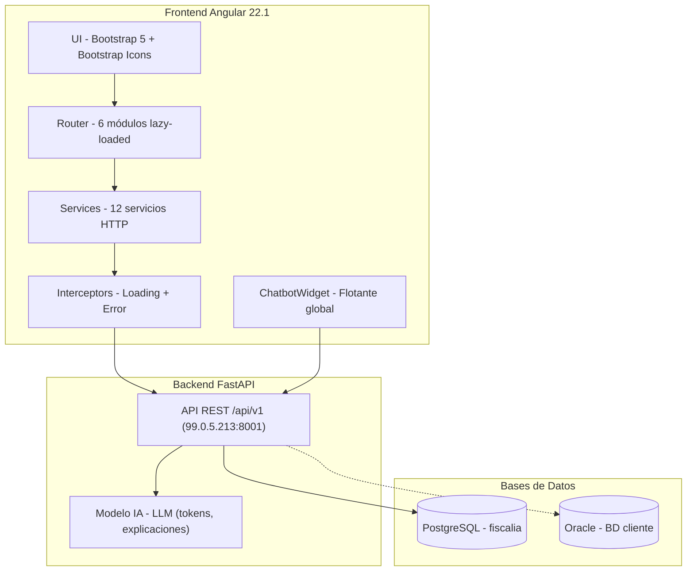
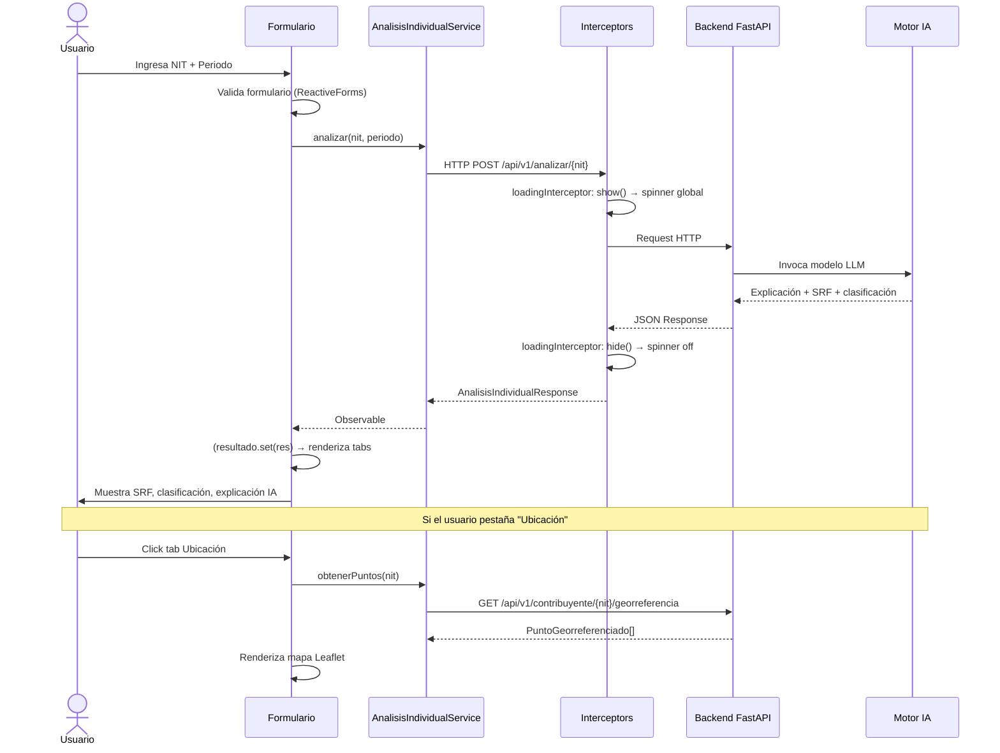
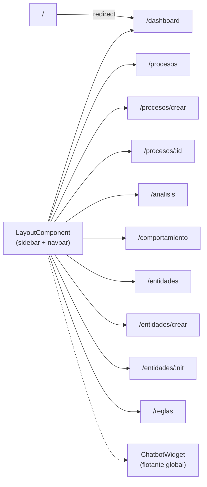

# Arquitectura — Fiscalización IA (Gestion_ia)

> Documentación técnica del frontend Angular del sistema de fiscalización tributaria con inteligencia artificial.

---

## 1. Arquitectura General



**Stack tecnológico:**

| Capa | Tecnología | Versión |
|---|---|---|
| Framework | Angular | 22.1.0 |
| CLI | @angular/cli | 22.1.5 |
| TypeScript | typescript | 6.0.2 |
| UI | Bootstrap | 5.3.8 |
| Iconos | Bootstrap Icons | 1.13.1 |
| Mapas | Leaflet | 1.9.4 |
| Reactividad | RxJS | 7.8.0 |
| Modales | SweetAlert2 | (reciente) |
| Testing | Vitest | 4.0.8 |
| Formateo | Prettier | 3.8.1 |
| Backend | FastAPI (Python) | — |
| BD principal | PostgreSQL | 17.7 |

**Arquitectura de componentes:** Standalone (sin NgModules). Cada componente se declara independientemente con `standalone: true` y se carga bajo demanda via `loadComponent`.

---

## 2. Estructura del Proyecto

```
Gestion_ia/
├── angular.json                    Configuración del proyecto Angular
├── package.json                    Dependencias y scripts
├── proxy.conf.js                   Proxy API → http://99.0.5.213:8001
├── proxy.conf.json                 Proxy API (alternativo, mismo target)
├── tsconfig.json                   Configuración TypeScript base
├── tsconfig.app.json               Configuración TS para la app
└── src/
    ├── main.ts                     Bootstrap de la aplicación
    ├── index.html                  HTML shell
    ├── styles.css                  Estilos globales
    │
    ├── environments/
    │   ├── environment.ts                  Default (desarrollo)
    │   ├── environment.development.ts      Desarrollo local
    │   └── environment.production.ts       Producción
    │
    ├── core/
    │   ├── interceptors/
    │   │   ├── loading.interceptor.ts      Spinner global en cada request HTTP
    │   │   └── error.interceptor.ts        Manejo de errores 401/403/500
    │   │
    │   ├── services/
    │   │   ├── analisis-individual.service.ts
    │   │   ├── analisis-comportamental.service.ts
    │   │   ├── chatbot.service.ts
    │   │   ├── dashboard.service.ts
    │   │   ├── entidad-fiscalizadora.service.ts
    │   │   ├── georreferenciacion.service.ts
    │   │   ├── hallazgos.service.ts
    │   │   ├── health.service.ts
    │   │   ├── loading.service.ts
    │   │   ├── notification.service.ts
    │   │   ├── proceso-fiscalizacion.service.ts
    │   │   └── reglas-fiscalizacion.service.ts
    │   │
    │   └── models/
    │       ├── analisis.model.ts
    │       ├── chat.model.ts
    │       ├── dashboard.model.ts
    │       ├── entidad.model.ts
    │       ├── hallazgo.model.ts
    │       ├── health.model.ts
    │       ├── pagination.model.ts
    │       ├── punto-georreferenciado.model.ts
    │       └── proceso.model.ts
    │
    └── app/
        ├── app.ts                    Componente raíz
        ├── app.config.ts             Providers (router, HTTP, interceptors)
        ├── app.routes.ts             Definición de rutas
        ├── app.html                  Template raíz
        │
        ├── layout/
        │   ├── layout.component.ts        Shell principal (sidebar + navbar + router-outlet)
        │   ├── sidebar/sidebar.component.ts
        │   └── navbar/navbar.component.ts
        │
        ├── shared/components/
        │   ├── chatbot-widget/        Widget flotante de chat IA
        │   ├── empty-state/           Estado vacío placeholder
        │   ├── loading-spinner/       Spinner de carga
        │   ├── mapa-ubicaciones/      Mapa Leaflet de puntos georreferenciados
        │   ├── page-header/           Título + breadcrumb
        │   ├── risk-gauge/            Medidor circular de riesgo SRF
        │   ├── risk-thermometer/      Termómetro de nivel de riesgo
        │   ├── stat-card/             Tarjeta KPI (valor + icono)
        │   └── status-badge/          Badge de estado/clasificación
        │
        └── features/
            ├── dashboard/             Panel principal KPIs
            ├── procesos/              Análisis de contribuyente (antes "Procesos")
            │   ├── procesos-listar/
            │   ├── proceso-crear/
            │   └── proceso-detalle/
            ├── analisis/              Análisis individual y comportamental
            │   ├── analisis-individual/
            │   └── analisis-comportamental/
            ├── entidades/             Gestión de entidades fiscalizadoras
            │   ├── entidades-listar/
            │   ├── entidad-crear/
            │   └── entidad-detalle/
            └── reglas/                Reglas fiscales R1-R10 y hallazgos
```

---

## 3. Módulos y Funcionalidades

### 3.1 Dashboard

| Aspecto | Detalle |
|---|---|
| **Propósito** | Panel de control con KPIs globales: total procesos, clasificación (OMISO/INEXACTO/EXACTO), nivel de riesgo, métricas de IA (tokens) |
| **Componente** | `DashboardComponent` |
| **Servicio** | `DashboardService` |
| **Endpoint** | `GET /api/v1/dashboard` |
| **Modelo** | `DashboardData` |
| **Ruta** | `/dashboard` (lazy) |

### 3.2 Análisis de Contribuyente (antes "Procesos")

| Aspecto | Detalle |
|---|---|
| **Propósito** | Crear y gestionar campañas de fiscalización masiva por entidad. Cada campaña analiza NITs de contribuyentes contra datos exógenos y genera clasificación. |
| **Componentes** | `ProcesosListar` (buscar por NIT), `ProcesoCrear` (formulario con periodo anual, vigencia automática, tipo de análisis), `ProcesoDetalle` (pestañas: Resumen con gráfico de clasificación, Información, Estado con polling, Resultados con filtro, Errores) |
| **Servicios** | `ProcesoFiscalizacionService` |
| **Endpoints** | `POST /api/v1/proceso`, `GET /api/v1/proceso`, `GET /api/v1/proceso/{id}/status`, `GET /api/v1/proceso/{id}/results`, `GET /api/v1/proceso/{id}/errors`, `GET /api/v1/proceso/{id}/export`, `POST /api/v1/proceso/{id}/cancelar`, `GET /api/v1/proceso/{id}/ranking-comportamental` |
| **Modelos** | `ProcesoHeader`, `CrearProcesoRequest`, `ProcesoCreadoResponse`, `ProcesoStatusResponse`, `ProcesoResultado`, `ProcesoError`, `EstadoProceso`, `TipoProceso`, `TipoRegimen` |
| **Rutas** | `/procesos`, `/procesos/crear`, `/procesos/:id` (lazy) |

### 3.3 Análisis Individual

| Aspecto | Detalle |
|---|---|
| **Propósito** | Evaluar un contribuyente específico por NIT: calcula SRF (Score de Riesgo Fiscal), clasifica (OMISO/INEXACTO/EXACTO), genera explicación con IA. Muestra ubicación georreferenciada en mapa Leaflet. |
| **Componente** | `AnalisisIndividualComponent` (tabs: Resumen, Ubicación) |
| **Servicios** | `AnalisisIndividualService`, `GeorreferenciacionService` |
| **Endpoints** | `POST /api/v1/analizar/{nit}`, `GET /api/v1/contribuyente/{nit}/georreferencia` |
| **Modelo** | `AnalisisIndividualResponse`, `PuntoGeorreferenciado` |
| **Ruta** | `/analisis` (lazy) |

### 3.4 Análisis Comportamental (Análisis 360)

| Aspecto | Detalle |
|---|---|
| **Propósito** | Comparar comportamiento fiscal de un contribuyente contra su sector (mismo CIIU + régimen). Incluye: score comportamental, desviaciones estadísticas, benchmark sectorial, expediente fiscal completo, grafo de riesgo. |
| **Componente** | `AnalisisComportamentalComponent` (tabs: Comportamiento, Expediente Fiscal) |
| **Servicio** | `AnalisisComportamentalService` |
| **Endpoints** | `GET /api/v1/contribuyente/{nit}/comportamiento`, `GET /api/v1/contribuyente/{nit}/expediente-fiscal`, `GET /api/v1/contribuyente/{nit}/grafo-riesgo`, `GET /api/v1/visor/grafo/{nit}` |
| **Ruta** | `/comportamiento` (lazy) |

### 3.5 Entidades Fiscalizadoras

| Aspecto | Detalle |
|---|---|
| **Propósito** | CRUD de entidades fiscalizadoras (municipios). Cada entidad se identifica por NIT. |
| **Componentes** | `EntidadesListar` (buscar por NIT), `EntidadCrear`, `EntidadDetalle` |
| **Servicio** | `EntidadFiscalizadoraService` |
| **Endpoints** | `POST /api/v1/entidad_fiscalizadora`, `GET /api/v1/entidad_fiscalizadora/{nit}` |
| **Modelo** | `EntidadFiscalizadora`, `CrearEntidadRequest` |
| **Rutas** | `/entidades`, `/entidades/crear`, `/entidades/:nit` (lazy) |
| **Nota** | El endpoint de listado plural (`/entidades_fiscalizadoras`) retorna "Listado no implementado" en el backend |

### 3.6 Reglas y Hallazgos

| Aspecto | Detalle |
|---|---|
| **Propósito** | Evaluar y ejecutar reglas fiscales (R1-R10), gestionar hallazgos con revisión humana (VALIDAR/DESCARTAR/PEDIR_INFO/TRASLADAR) y revisión por agente IA. |
| **Componente** | `ReglasFiscalizacionComponent` |
| **Servicios** | `ReglasFiscalizacionService`, `HallazgosService` |
| **Endpoints** | `POST /api/v1/fiscalizacion/reglas/evaluar/{nit}`, `POST /api/v1/fiscalizacion/reglas/ejecutar/{nit}`, `GET/POST /api/v1/fiscalizacion/hallazgos`, `POST /api/v1/fiscalizacion/hallazgos/{id}/revision`, `POST /api/v1/fiscalizacion/hallazgos/{id}/revision-agente` |
| **Modelo** | `Hallazgo`, `ReglasEvaluarRequest`, `RevisionRequest`, `EstadoHallazgo`, `DecisionRevision`, `ReglaFiscalizacion` |
| **Ruta** | `/reglas` (lazy) |

### 3.7 Chatbot (Asistente FiscalIA)

| Aspecto | Detalle |
|---|---|
| **Propósito** | Widget flotante con asistente IA en lenguaje natural. Responde preguntas sobre procesos, hallazgos, análisis, reglas. Ofrece acciones sugeridas (botones que navegan a pantallas). |
| **Componente** | `ChatbotWidgetComponent` (siempre visible, no depende de ruta) |
| **Servicio** | `ChatbotService` |
| **Endpoint** | `POST /api/v1/chat` (o modo mock local) |
| **Modelo** | `ChatMessage`, `ChatRequest`, `ChatResponse`, `ChatAccionSugerida` |
| **Integración IA** | Ver sección 7 |

---

## 4. Flujo de Datos y Estado

### 4.1 Manejo de Estado

El proyecto **no usa NgRx ni RxJS BehaviorSubject** para estado global. Utiliza **Angular Signals** como patrón principal:

- **Loading global:** `LoadingService.isLoading()` — signal boolean, actualizado por `loadingInterceptor` en cada request HTTP.
- **Notificaciones:** `NotificationService.notificaciones()` — signal array de toasts (success/error/warning/info), auto-dismiss a 5s.
- **Estado por componente:** Cada componente gestiona sus propios signals (`resultado`, `analyzing`, `loading`, etc.).
- **Historial chat:** `ChatbotService.historial` — array plano en memoria (no persistido).

### 4.2 Flujo End-to-End: Análisis Individual de Contribuyente



### 4.3 Manejo de Errores y Loading

| Capa | Mecanismo |
|---|---|
| **Loading global** | `loadingInterceptor` incrementa/decrementa contador en `LoadingService`. `LayoutComponent` muestra overlay con spinner si `isLoading() === true` |
| **Errores HTTP** | `errorInterceptor` intercepta 401/403/500 → muestra toast vía `NotificationService.error()` y re-lanza el error |
| **Errores por componente** | Cada servicio tiene `catchError` con fallback a datos vacíos/por defecto → el componente nunca crashea, muestra estado vacío |
| **Loading local** | Cada componente usa signals (`analyzing`, `loading`, `saving`) para estados de carga específicos de sus operaciones |

---

## 5. Autenticación y Seguridad

### Estado actual: **Sin autenticación implementada**

- **No hay login** — la app arranca directamente en el dashboard.
- **No hay guards de ruta** — todas las rutas son accesibles sin token.
- **No hay JWT, sesiones ni roles.**
- El navbar muestra un usuario hardcodeado "Admin" con dropdown (Mi perfil, Configuración, Cerrar sesión) — son links placeholder sin funcionalidad.
- El `errorInterceptor` maneja 401/403 pero solo muestra toast, no redirige a login.

**Endpoints protegidos en backend:** El backend FastAPI no aplica autenticación en sus endpoints (accesibles sin token). Si se agregara auth en el futuro, se necesitaría:
1. Login component + JWT interceptor para inyectar `Authorization: Bearer <token>`.
2. AuthGuard en las rutas.
3. Eliminar la sección hardcodeada del navbar.

---

## 6. Configuración e Infraestructura

### 6.1 Ambientes

| Variable | Desarrollo | Producción |
|---|---|---|
| `apiBaseUrl` | `/api/v1` | `/api/v1` |
| `geoApiUrl` | `/api/v1` | `/api/v1` |
| `chatbotApiUrl` | `/api/v1` | `/api/v1` |
| `useMockGeo` | `true` | `false` |
| `useMockChatbot` | `true` | `false` |

Las URLs son relativas (`/api/v1`). El proxy de desarrollo redirige `/api/*` al backend real.

### 6.2 Proxy API (desarrollo local)

```js
// proxy.conf.js
module.exports = {
  '/api': {
    target: 'http://99.0.5.213:8001',
    secure: false,
    changeOrigin: true,
    logLevel: 'debug',
  },
};
```

En `angular.json`, el serve usa `proxyConfig: "proxy.conf.js"`. Las peticiones `/api/v1/*` se redirigen al backend FastAPI.

### 6.3 Scripts de Build

```json
{
  "start": "ng serve --configuration development",
  "build": "ng build",
  "watch": "ng build --watch --configuration development",
  "test": "ng test"
}
```

- `ng serve` usa proxy `proxy.conf.js` (requiere backend corriendo en `99.0.5.213:8001`).
- `ng build` genera producción en `dist/Gestion_ia/`.
- Budget: warning 500kB, error 1MB (bundle inicial).

### 6.4 Integración con IA (Backend FastAPI)

El componente de IA vive en el **backend**, no en el frontend. El frontend se comunica con:

| Funcionalidad | Endpoint | Descripción |
|---|---|---|
| Análisis individual | `POST /analizar/{nit}` | Calcula SRF + clasificación + explicación IA. Consumo de tokens del LLM. |
| Análisis comportamental | `GET /contribuyente/{nit}/comportamiento` | Score comportamental vs sector. |
| Expediente fiscal | `GET /contribuyente/{nit}/expediente-fiscal` | Documento consolidado con IA (Markdown). |
| Grafo de riesgo | `GET /contribuyente/{nit}/grafo-riesgo` | Grafo de relaciones + resumen IA. |
| Ranking | `GET /proceso/{id}/ranking-comportamental` | Ranking de contribuyentes por riesgo. |
| Chatbot | `POST /chat` | Lenguaje natural → respuesta del LLM + acciones sugeridas. |
| Revisiones IA | `POST /fiscalizacion/hallazgos/{id}/revision-agente` | Agente IA revisa hallazgo automáticamente. |

El frontend **no tiene configuración de modelo/prompt** — toda la lógica de IA (prompt engineering, selección de modelo, gestión de tokens) está en el backend FastAPI. El frontend solo consume las respuestas y renderiza:
- `explicacion_ia` → texto libre del LLM.
- `modo_degradado` → indica si el análisis fue sin IA (fallback determinístico).
- `tokens_utilizados` → consumo de tokens en el análisis.

**Chatbot:** En modo mock (default en desarrollo), `ChatbotService` responde con reglas por keywords sin llamar al backend. Cuando `useMockChatbot = false`, llama `POST /chat` al backend.

---

## 7. Diagrama de Rutas



Todas las rutas son lazy-loaded con `loadComponent`. No existen guards ni protección de rutas.

---

## 8. Cómo Levantar el Proyecto en Local

### Prerrequisitos
- Node.js >= 18
- npm >= 9
- Backend FastAPI corriendo en `http://99.0.5.213:8001` (o ajustar proxy)

### Instalación
```bash
cd C:\Angular_IA\Gestion_ia
npm install
```

### Desarrollo
```bash
npm start
# Equivale a: ng serve --configuration development
# Abre http://localhost:4200
# Proxy: /api/* → http://99.0.5.213:8001
```

> **Nota:** El proxy requiere que el backend esté accesible. Si no está disponible, las llamadas API fallarán pero la UI seguirá funcionando (mocks para geo y chatbot).

### Build de producción
```bash
ng build
# Output: dist/Gestion_ia/
```

### Variables de entorno (sin secretos)
El archivo `proxy.conf.js` contiene la dirección del backend (`99.0.5.213:8001`). Para cambiar el backend en desarrollo, modificar este archivo. No hay tokens, API keys ni credenciales en el frontend.

### Testing
```bash
npm test
# Vitest runner
```
